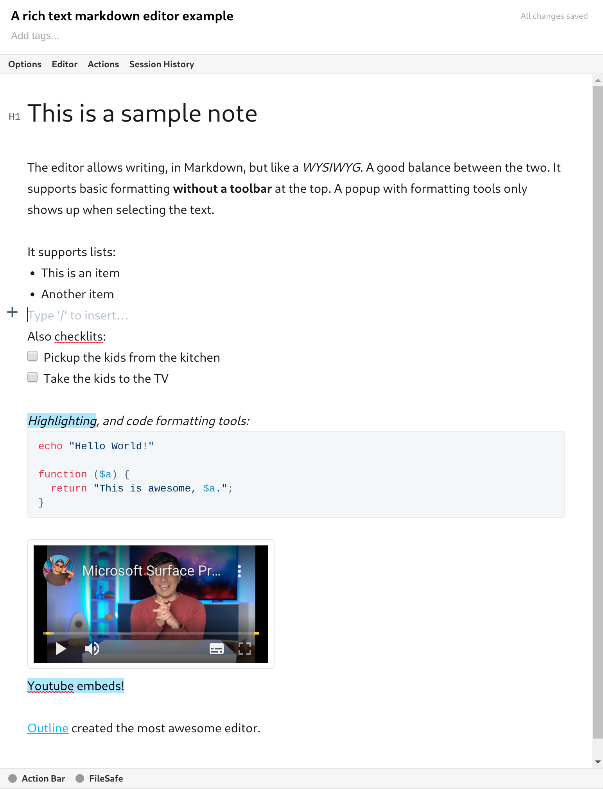

## Rich Markdown Editor for Standard Notes



This is an attempt to use Outline's editor into Standard Notes.

Outline uses an awesome Markdown editor, [Rich Markdown Editor](https://github.com/outline/rich-markdown-editor) that fits great with Standard Notes. It is very close to what Bear does on Mac.

This is my first React application, so probably there are a lot of improvements. Feel free to make recommendations and/or open issues.

**Status**
*What's currenlty working**

- [x] **Editor**. It is possible to edit, save and create new styled notes.
- [x] **Links**. Links work with `cmd/meta+click`.
- [ ] **FileSafe**. Implementing FileSafe will allow the editor to embed images.
- [X] **YouTube Embeds**: Youtube embeds.

To install it, use the extension endpoint below:

```
https://listed.to/p/K6AXOLFLF6
```
